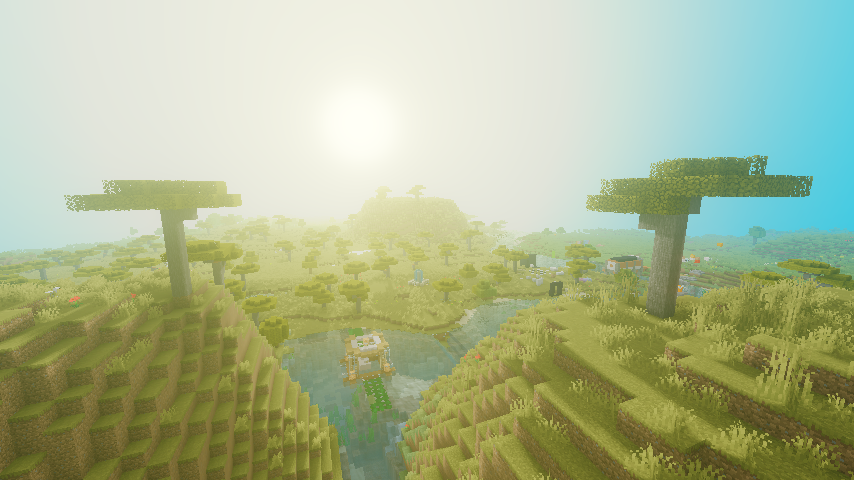
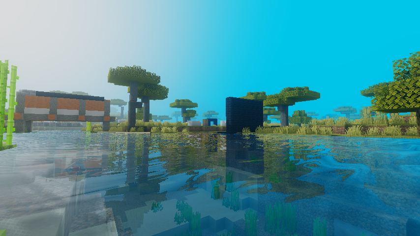
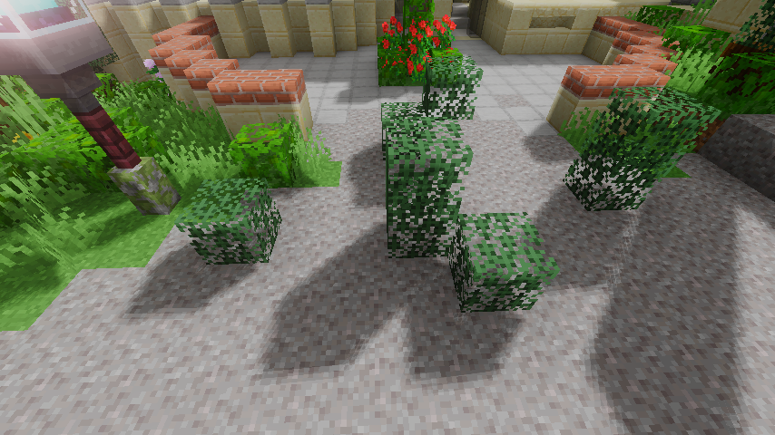
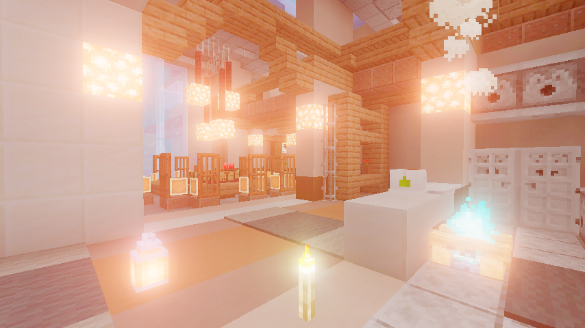
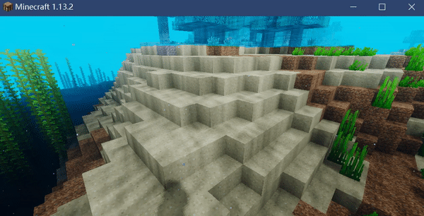

# Toy Minecraft Shaders

Toy Minecraft Shaders 是一个简单的基于Optifine mod的shader集，包括复数渲染算法及效果。

# Features

大气雾模拟：

具有ray marching和菲涅耳反射的屏幕空间反射（SSR）：

PCF软阴影贴图：

Bloom与Mipmap，向下采样（降分辨率）和高斯模糊：

使用噪波纹理和正弦余弦波进行焦散模拟：

# 安装到 MC

1. 首先需要安装OptifineHD mod
2. 然后将着色器包文件复制到游戏目录`.minecraft/shaderpacks`
3. 在游戏菜单中选择：`vedio setting --> shades`
